# Clipboard, machines and quick forwarding

The workspace now uses three content densities. Compact makes scanning the priority, Balanced keeps everyday actions visible, and Expanded exposes forwarding controls and more detail. Transfers and Clipboard remain equally accessible.

| Display label | Existing saved value | Behavior |
|---|---|---|
| Compact | `compact` | Single-line machine and clipboard rows; accessible hover/focus actions; on-demand clipboard preview. |
| Balanced (default) | `expanded` | Two-line cards, route/destination pills, persistent machine actions; clipboard preview adapts to available space. |
| Expanded | `large` | Permanent direction/port controls, recent transfer receipts, larger clipboard inspector. |

The values and native sizing interface are unchanged, including configuration import/export. A visible View selector makes density available without opening Settings. The app remains dark-only.

A machine's globe opens its small connection bar the first time. Enter a URL such as `http://localhost:1331`; Local means the selected SSH machine reaches that service while this device listens. Advanced exposes the listening port, destination port and Local/Remote direction. A saved local website can be reopened with one click. Remote forwarding never opens the remote listener as though it were local.

The bar reports Forwarding, Live or a failure inline. Live describes the SSH tunnel, not application health. Stop works during startup. Additional live connections are exposed through a visible count rather than clipped controls. URL drops edit the connection field; file/text drops on machine targets retain transfer behavior.

Website scheme and pathname are remembered in renderer preferences for the saved plan. Query strings and fragments remain in memory for the current session and are excluded from that persistence. Existing saved plans with no website scheme require an explicit website choice. These supplementary website preferences are not part of portable configuration exports. HTTPS is never downgraded; certificates and virtual-host routing must support the chosen local address.

Clipboard has one primary history scroller, stationary search/actions, and a separate inspector only when displayed. Keyboard navigation uses a single list focus target. Search, filter, selection and scroll survive workspace switches. Copy feedback stays on the action. Escape closes the local editor before hiding the app. Capture remains opt-in, and status reflects the existing editing pause. Clearing all unpinned clipboard history is explicitly global; shelf Undo remains a separate feature.

The existing hooks expose no network latency or durable successful-connect timestamp. Expanded therefore shows current SSH status and up to three actual transfer receipts. Item names are resolved only where current shelf data still identifies them; otherwise the receipt shows a count. Receipt times are request times. No synthetic latency or last-connected value is presented.

## Browser capability

The only added native capability is `openTunnelSite({id, scheme, path})`. It accepts an existing running Local tunnel, derives the loopback listening address from the backend, and validates HTTP/HTTPS and the relative page path. It verifies that the current host still matches the tunnel's SSH endpoint. Removed/changed machines, arbitrary destinations, Remote/failed/stopped sessions, malformed paths and untrusted renderer callers are rejected. Existing window navigation restrictions remain in force. No arbitrary URL-copy capability or new global shortcut is introduced.

## Design tokens

Reused: `--canvas`, `--surface`, `--surface-raised`, `--surface-hover`, `--ink`, `--muted`, `--accent`, `--accent-hover`, `--accent-soft`, `--warning`/`--yellow`, `--line`, `--line-strong`, `--danger` and `--danger-soft`. Cyan represents ready/primary/selection/focus, yellow represents attention, and the existing error color represents destructive/failure states. No new palette hex values were added.

Added: `--font-mono`, a shared system-monospace stack for hostnames, endpoints, ports and paths. New structural styles live in `workspace.css`, `clipboard-workspace.css` and `quick-connect.css`. Ready uses a two-second ease-in-out opacity pulse, disabled under reduced motion.

## Verification

On 28 September 2026:

- 175 Node tests passed, including the native controller, browser-opening validation, URL parsing, endpoint safeguards, shared forwarding-operation races, clipboard, configuration, shelf Undo and singleton behavior.
- Headless machine/quick-connect tests passed for all densities, keyboard/context-menu access, reduced motion, exact URL-to-forward mapping, URL drop isolation, saved repeat, Remote semantics, failures, Stop during startup, independent per-host drafts, multiple-live-forward access, shelf Undo and batch sending.
- Eight Clipboard browser groups passed: three density/layout checks, workspace-state persistence, keyboard/copy/pin/focus behavior, global clear scope, stale-detail isolation, and opt-in/editing status.
- The actual new URL bar was exercised against a trusted POSIX host over Tailscale with the production SSH TunnelManager. Go returned the expected nonce from an owned in-memory HTTP fixture; Stop closed the listener; one-click saved repeat returned a second verified response; final Stop and cleanup closed the remote fixture, local listener and owned SSH processes. The browser-opening adapter fetched the validated address instead of creating an OS browser window.
- Grok 4.7 reviewed the design and performed earlier renderer compilations. Response metadata identified `grok-4.7-build`. After its final wrapper execution was blocked, the user authorized a direct local build; that fresh build, the added Balanced history-height check, and refreshed screenshots all passed.

Native Windows/Linux desktop execution and an actual OS browser launch were not performed in this pass. Browser-launch validation and dispatch were covered with inert native tests. Package and installation results are recorded separately in the v0.4.0 GitHub release notes.

Reproduce automated checks with Node 22.12+:

```sh
npm ci
npm test
npm run build
npx playwright install chromium
npm run test:ui
npm run test:ui:screenshots
```

For an existing Chromium installation, set `PLAYWRIGHT_CHROMIUM_EXECUTABLE_PATH`. Screenshot generation uses only the fictional bridge in `tests/ui/fixture.cjs`; it cannot read the native clipboard or contact SSH hosts. The real-host fixture used separate temporary state and is recorded separately from mocked UI evidence.

## Before and after

The before images use the unchanged v0.3.0 renderer with the same fictional data, stored modes and window sizes. The old labels Expanded/Large correspond to the new Balanced/Expanded labels.

| Workspace and density | Before | After |
|---|---|---|
| Transfers · Compact | 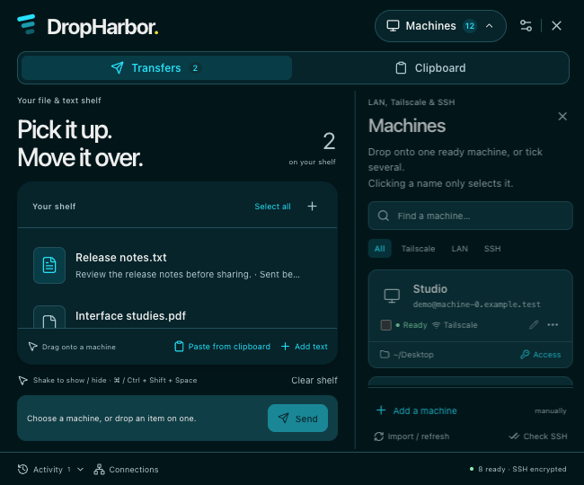 | 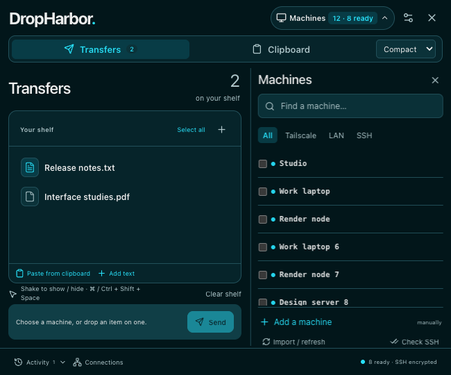 |
| Clipboard · Compact | 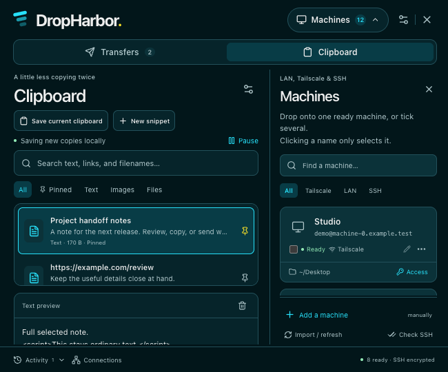 | 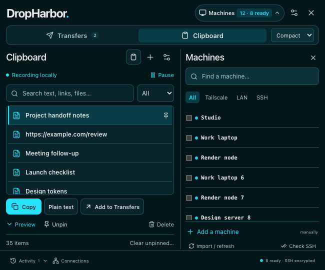 |
| Transfers · Balanced | 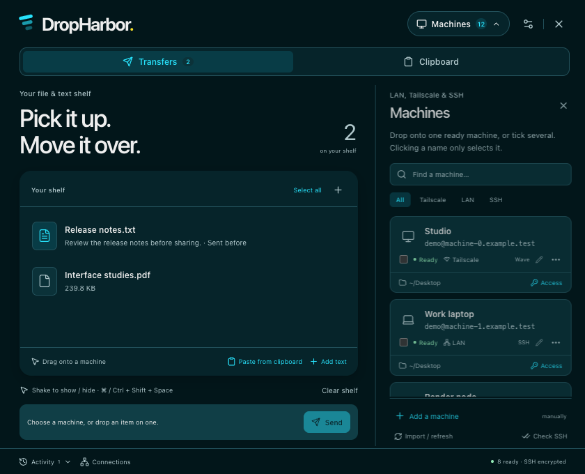 | 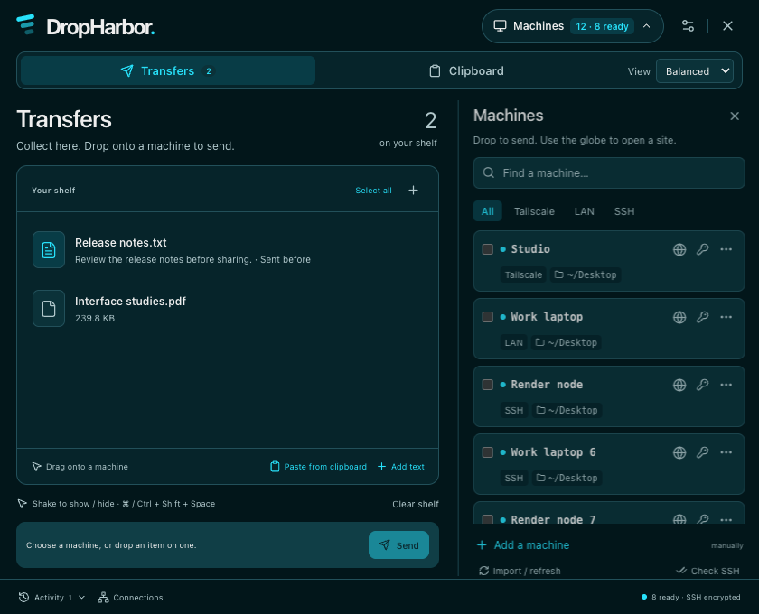 |
| Clipboard · Balanced | 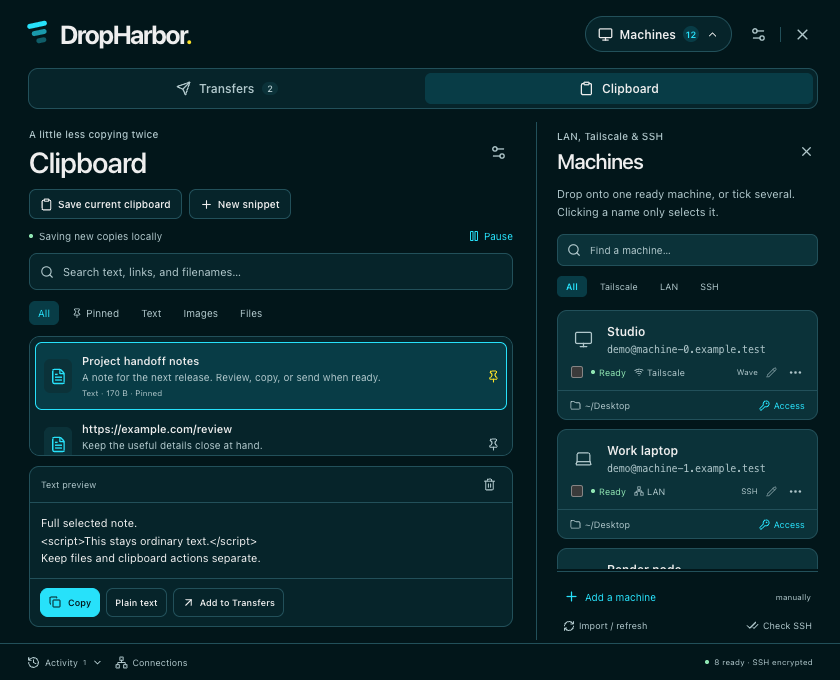 | 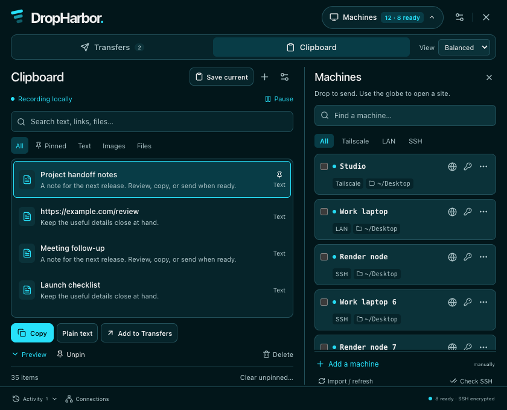 |
| Transfers · Expanded | 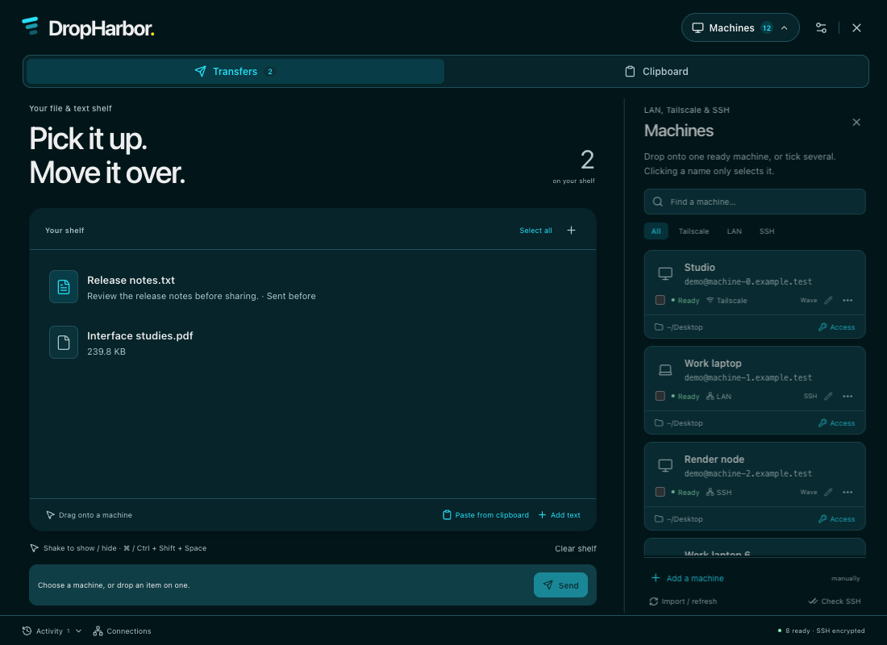 | 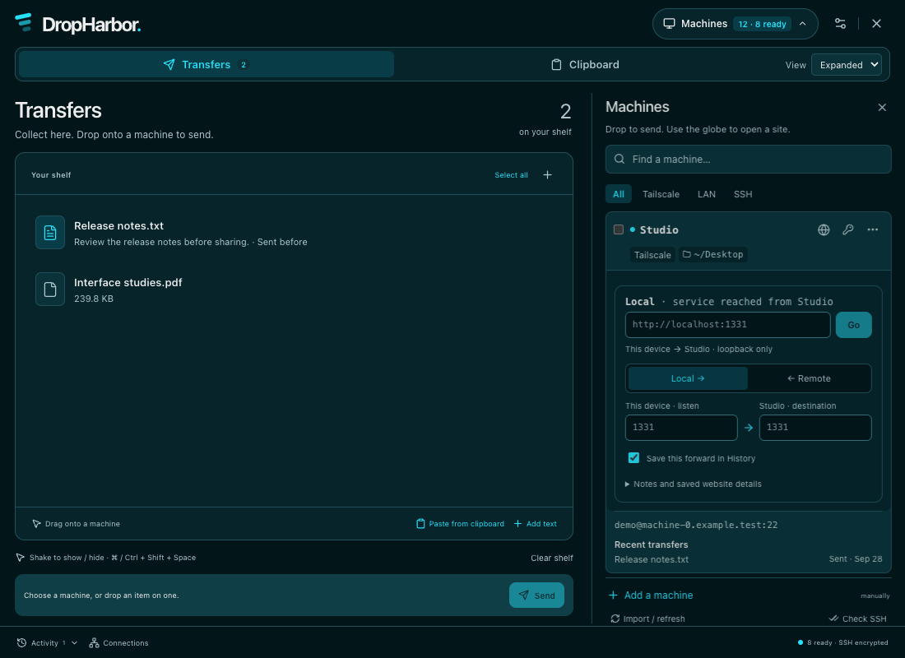 |
| Clipboard · Expanded | 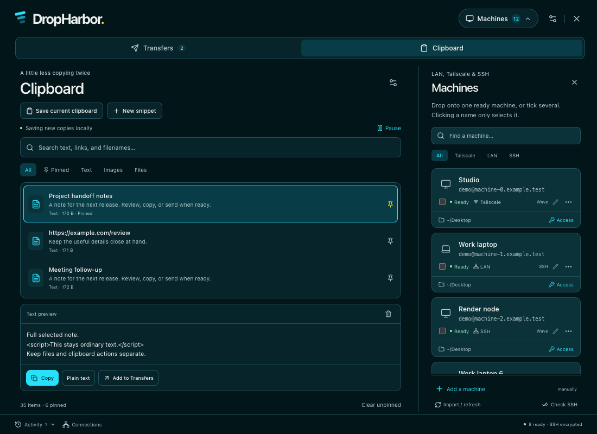 | 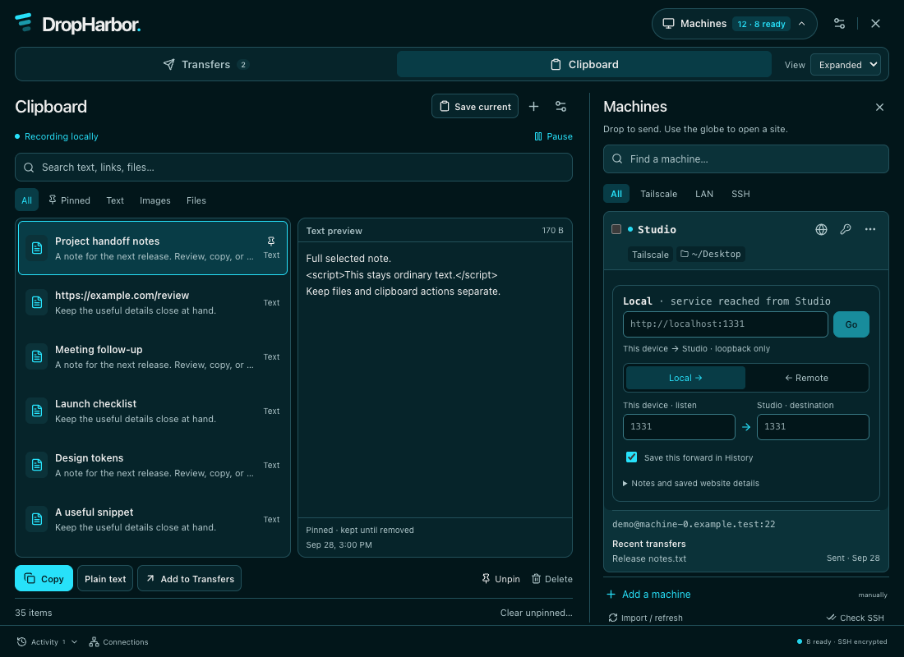 |

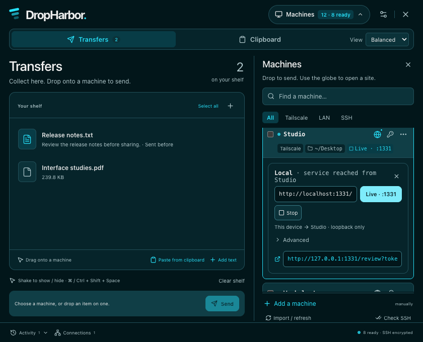
