# Optional tools and clear remote connections — v0.4.2

The default globe action opens the selected machine’s service on this computer. Its primary heading now reads **Remote service**. Advanced retains the correct SSH Local / Remote directions and explains them. Saved forwards and backend contracts are unchanged.

On macOS, **Machines → ⋯ → Install on this device…** opens a contextual installer. The selected machine is fixed, and the first line explains that installation currently supports Macs only. **Check Mac** explicitly verifies operating system, processor and the existing app before destination review. Opening the menu/dialog performs no remote probe or installation. Existing apps remain in place; the separate install step requires a valid reviewed plan. Keyboard users can use Shift+F10, choose the action, and return to the same machine after dismissing the dialog.

Clipboard starts off and has no tab until enabled in Settings. Version 0.4.1 could inherit a legacy history opt-in, so upgrading requires a fresh Settings choice once. Existing encrypted items are retained without expiry or rewriting while disabled. Enabling the feature alone does not start recording. Manual Paste from clipboard on Transfers remains available.

## Screenshots

All screenshots use fictional machines and shelf items. The prior version is documented in [the v0.4.1 palette comparison](palette.md). Each density below shows the new off-by-default layout, remote-service bar and contextual installation flow.

| View | Default | Remote service | Machine menu | Installer |
| --- | --- | --- | --- | --- |
| Compact | 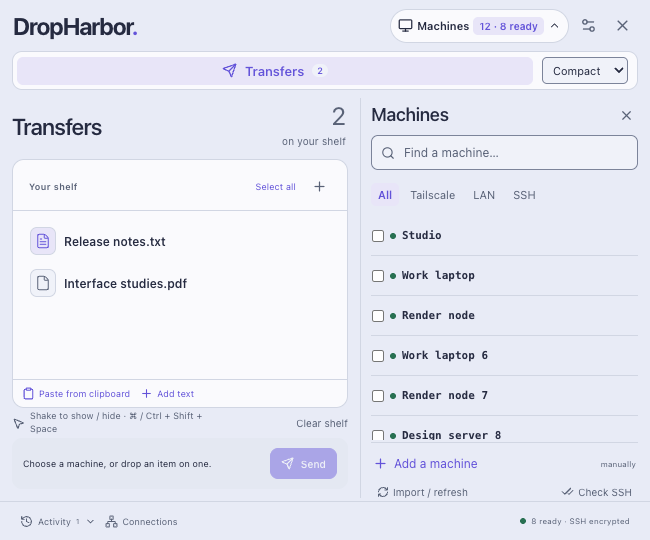 | 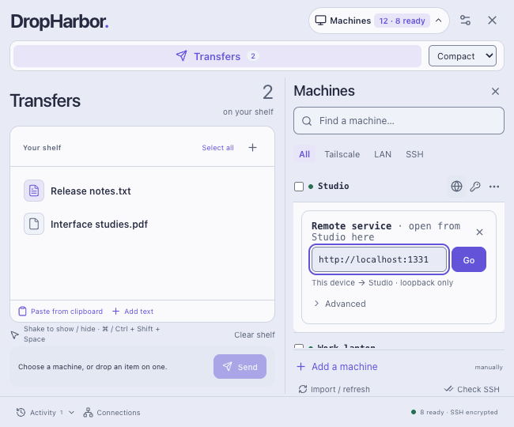 | 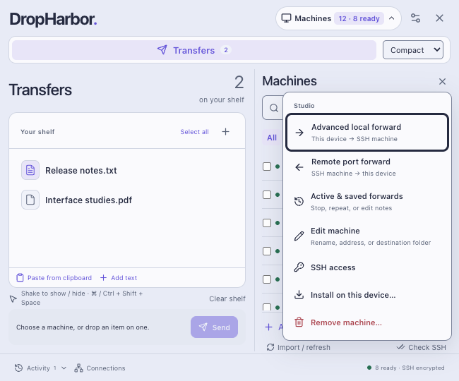 | 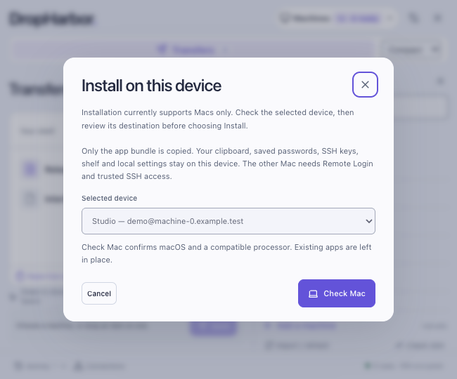 |
| Balanced | 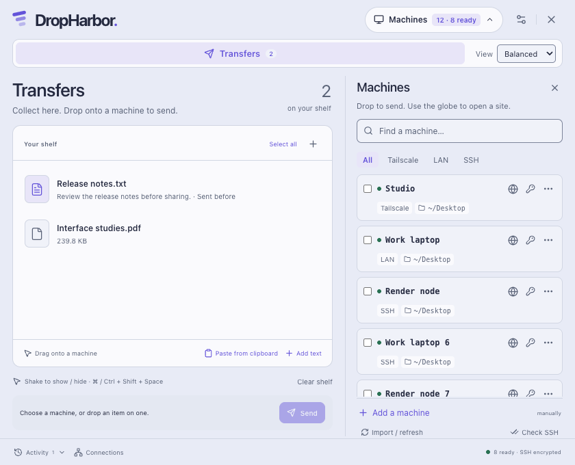 | 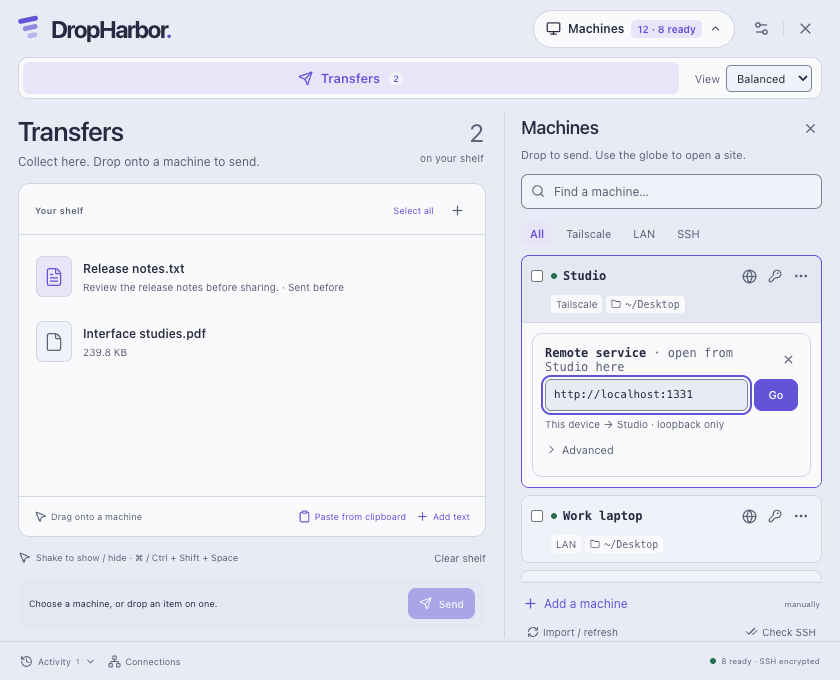 | 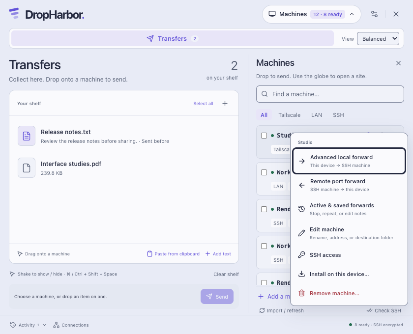 | 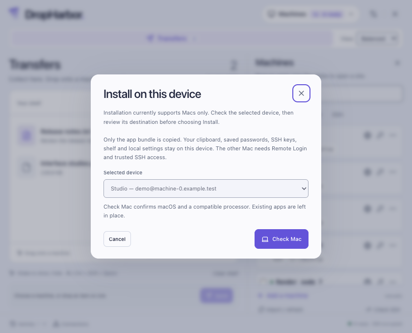 |
| Expanded | 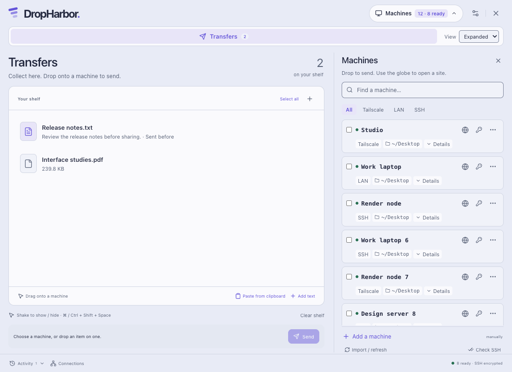 | 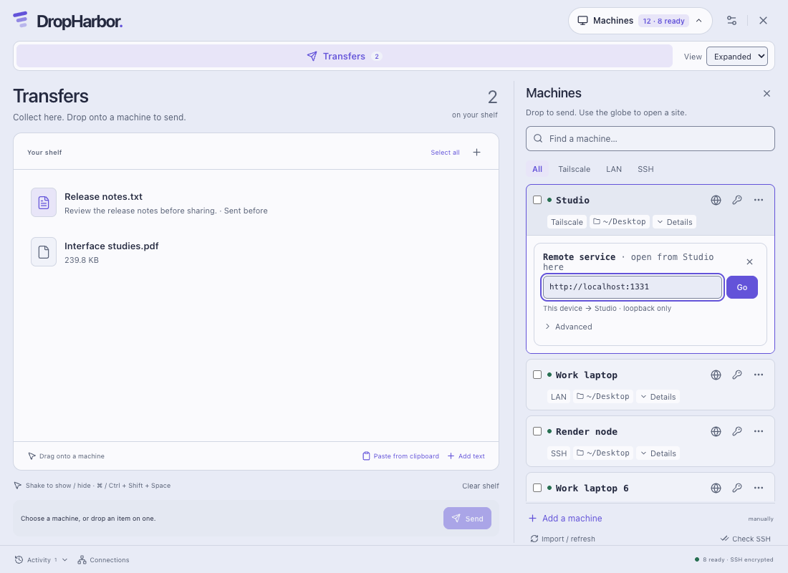 | 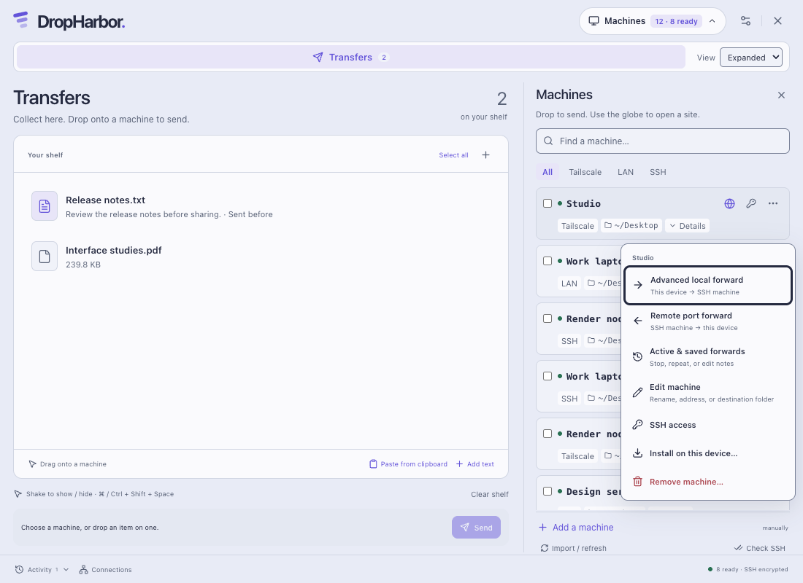 | 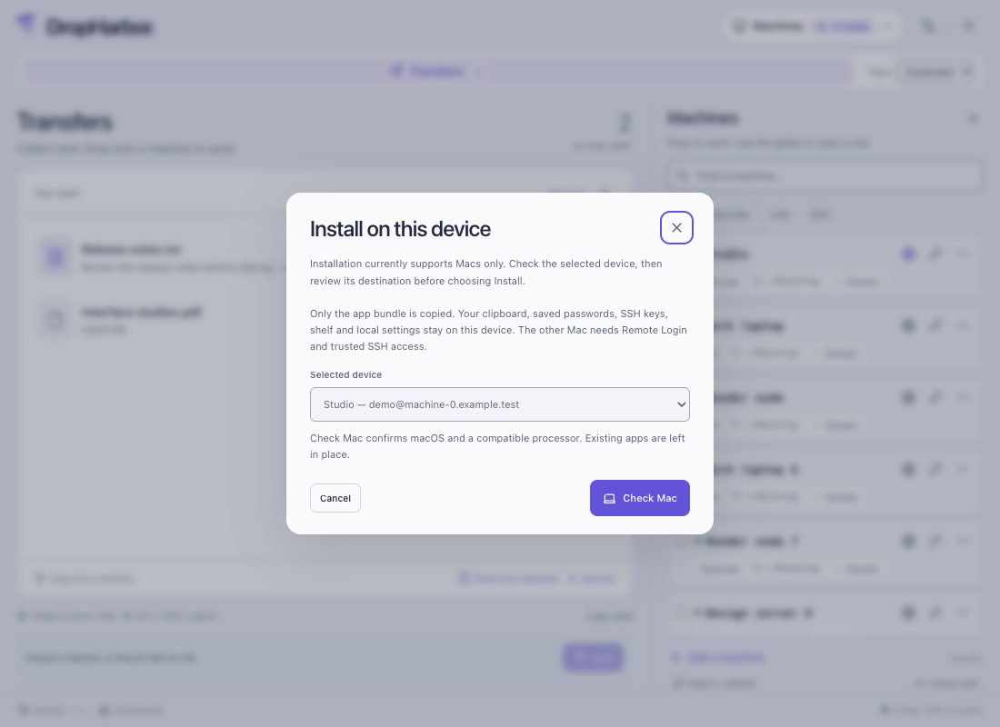 |

The existing light palette tokens are reused; no new colours, motion, backend forwarding modes or global shortcuts are introduced. Expanded device details remain closed by default.
