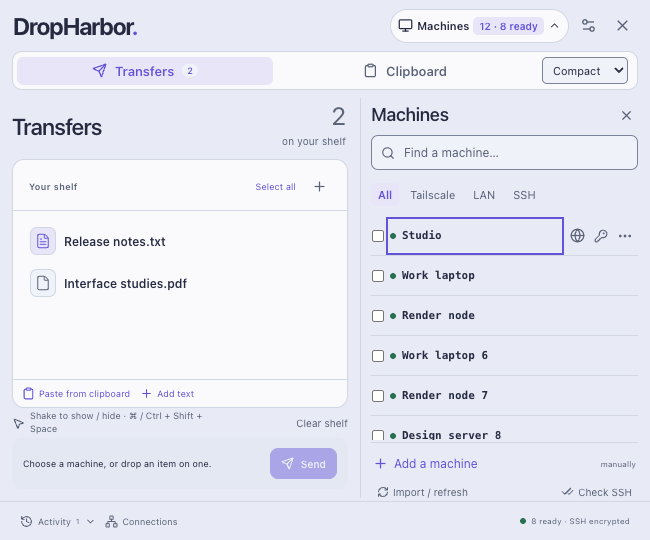
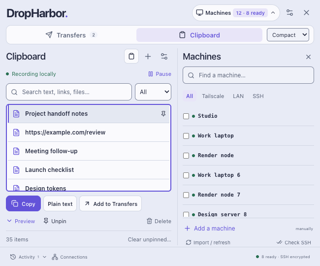
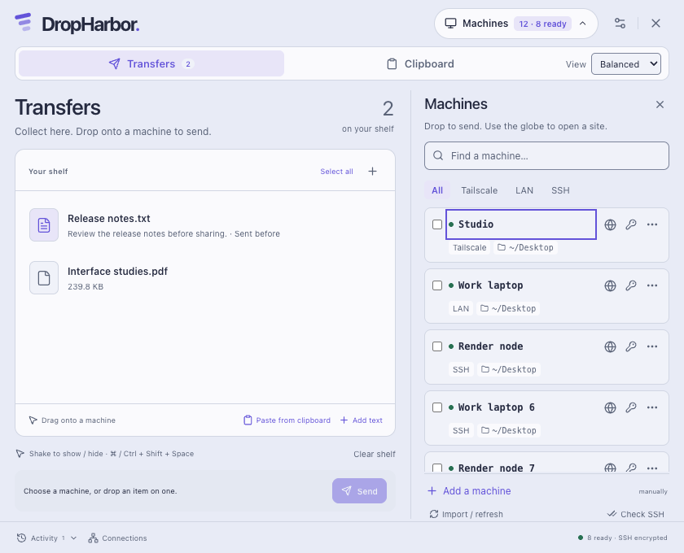
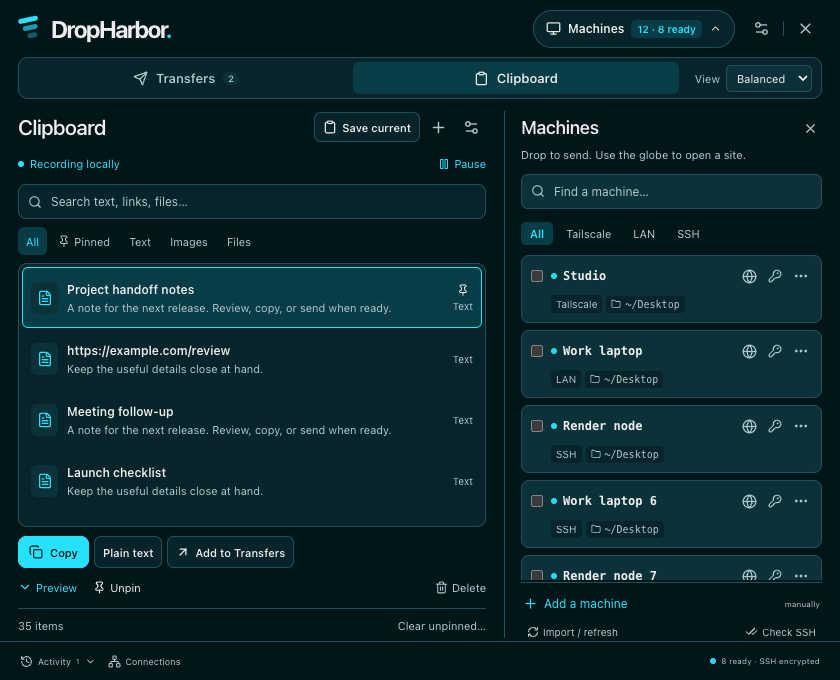
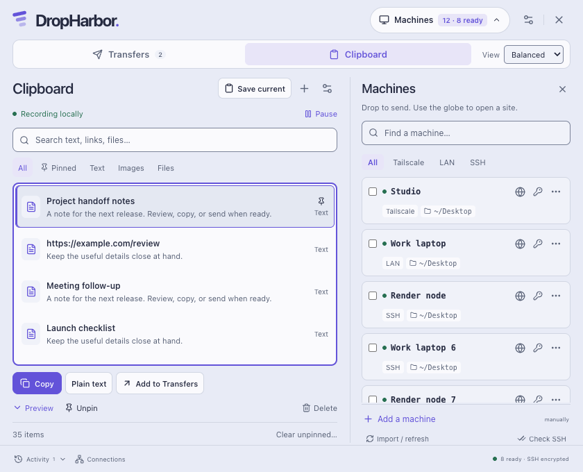
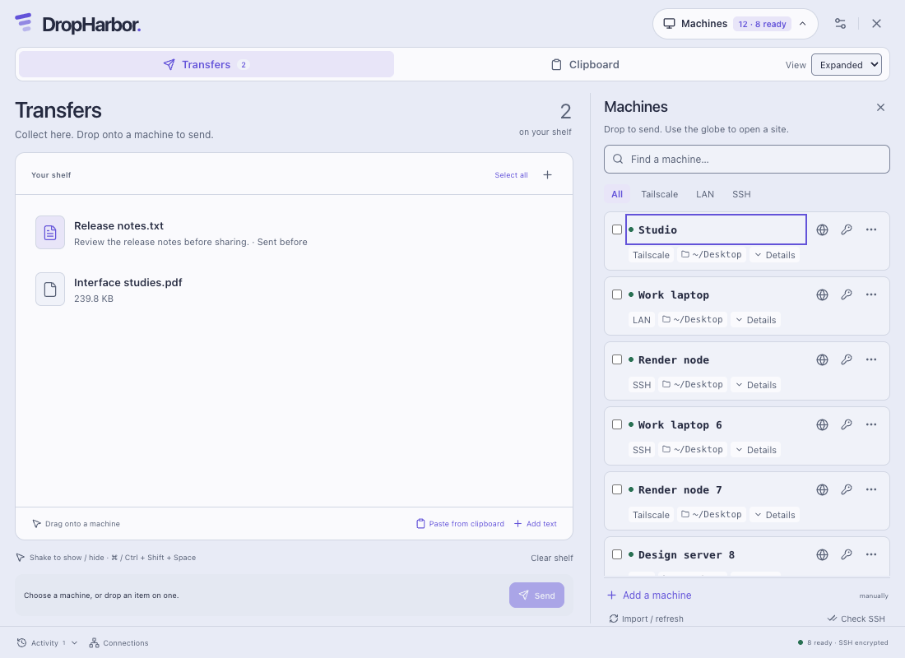
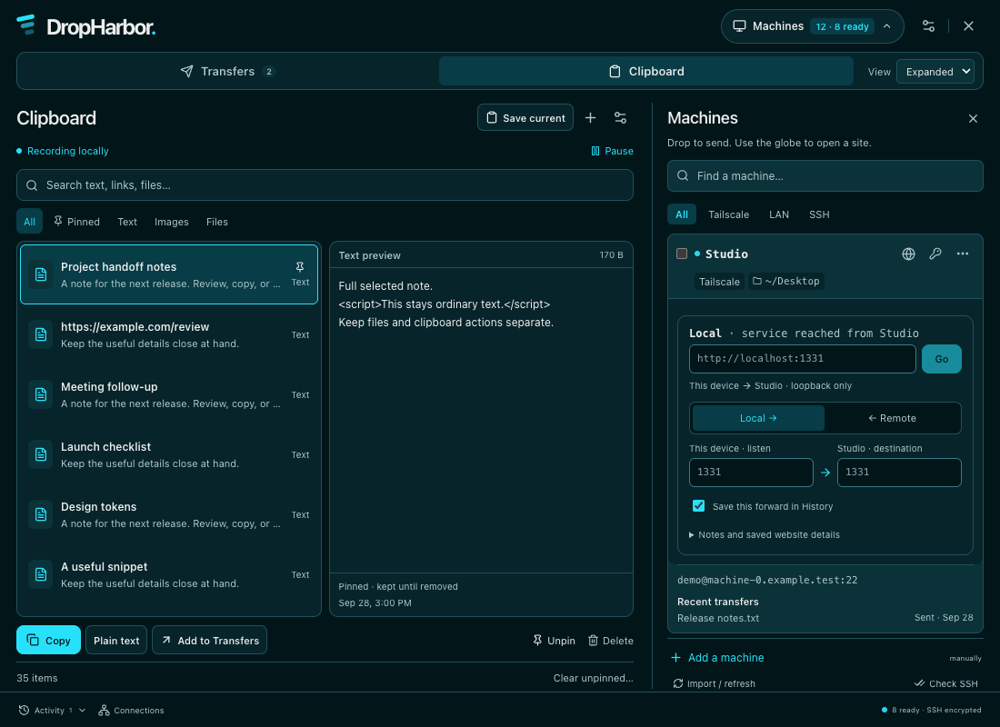
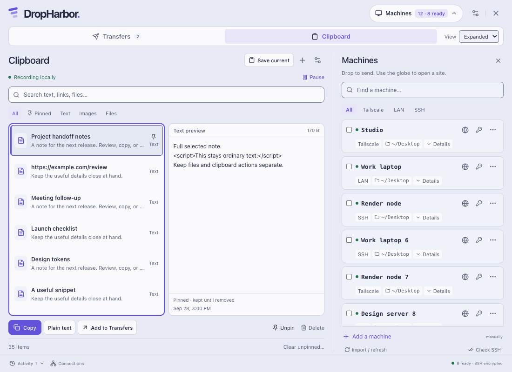

# Original lavender palette restored

Version 0.4.1 retains the three density layouts while restoring the original lavender, off-white, slate and purple palette. The main canvas, panel, text and accent colours come from the initial `29da5c6` version. Secondary text, input boundaries, semantic colours and shadows are tuned for the light surfaces.

Grok 4.7 reviewed a short, source-only palette description. Actual response metadata identified `grok-4.7-build`. It supported the restored colours, darker secondary labels, quieter shadows, and subtle ready pulse. Its selected-row edge suggestion is implemented as a 2px purple inset. Its proposed darker selected fill was not adopted: purple text measured 4.30:1 on that fill; the retained fill measures 4.508:1. Decorative separators stay subtle, while controls use a stronger boundary. The first, longer Grok request timed out; this opinion came from the successful focused follow-up.

Purple identifies primary actions, selection and keyboard focus. Green identifies Ready and successful connections; amber is for attention and muted red is for failures. Existing status labels, accessible names, messages, keyboard paths and reduced-motion support remain in place. The ready pulse still takes two seconds but now varies only from full to 80% opacity. Shortcuts, stored density choices, shelf drag-and-drop and ordinary transfer behavior stay intact. Clipboard availability and Mac installation now have the explicit controls described below.

The browser and native startup surfaces both match the lavender canvas. Drop overlays, menus, errors, selected text, placeholders and scrollbars use the same semantic palette. The old dark overlays and black shadows are removed. Existing configuration and personal data are retained.

## Expanded without automatic panels

Expanded gives the workspace more room while keeping each machine's extra details closed. Its per-machine **Details** disclosure opens recent transfer receipts only when selected; changing density and returning to Expanded starts collapsed again. Selecting a machine does not expand other rows or begin a transfer.

Forwarding controls open for the chosen host through its globe or connection menu in every density. The normal quick-connect view starts with the small URL bar; **Advanced** stays closed until the user asks for advanced controls, including an explicit Local/Remote menu entry. Expanded no longer opens forwarding forms for every device. Existing live-forward chips and Stop controls remain available on the cards.

## Optional Clipboard tools

New installations start with Clipboard tools off. **Settings → Enable Clipboard tools** makes the workspace available without starting automatic capture; automatic history still requires its own explicit opt-in in Clipboard. **Show Clipboard tab** hides or reveals the tab independently. Hiding returns to Transfers and does not pause already-enabled history, as the helper text states.

Disabling tools immediately gates native history actions, stops automatic recording and invalidates capture still in progress. Saved history is retained; disabled startup and polling do not trim it. Enabling tools again does not restore prior recording consent. Migration preserves only a valid existing history-capture opt-in. Local tools metadata and a migration marker prevent a later missing or corrupt tools file from reviving old consent. These preferences, clipboard data and credentials are excluded from configuration exports. Explicit shelf paste remains available regardless of the optional workspace.

## Install on another Mac

A packaged Mac sender can prepare a first installation for an existing saved SSH machine of the same architecture. **Check Mac** produces a destination/account/version review before the user explicitly chooses installation. A bundled personal preset requires a separate acknowledgement. The installer revalidates the plan and app, checks the archive hash and bundle identity, refuses an existing destination, and places only the app bundle under the receiving account's `~/Applications`. It reports progress and leaves the receiving app closed. It does not copy the sender's profile, create hosts, enable SSH, bypass host trust, or act as an updater.

The rest of the app remains cross-platform. This convenience is Mac-only, and no real remote installation has been tested yet. Existing Windows/Linux testing limits remain.

## Verification

Run `npm test`, `npm run build`, `npm run test:ui` and `npm run test:ui:palette`. The palette check uses the fictional fixture, measures rendered foreground/background colours including opacity, checks focused controls and placeholders, confirms matching startup backgrounds, and captures all three densities. Measurements cover representative states, not every possible screen or a whole-app accessibility certification. [Measured contrast pairs](palette/contrast.json) list the exact scope and results.

The combined v0.4.1 checks passed: 212 Node tests, the full three-density UI suite including optional Clipboard and Mac-install workflows, and 67 rendered contrast checks. Native installer tests use production shell commands against scratch app bundles with intercepted SSH/upload; no real remote destination was modified. Packaging and installed-app evidence are recorded separately in the v0.4.1 release notes. Windows/Linux packages remain cross-built and unsigned; this visual update does not establish native platform validation. Existing v0.4.0 real-host forwarding evidence is not represented as a fresh live-host test.

## Before and after

All images use the same fictional machine and clipboard data, with Clipboard tools explicitly enabled for comparison. The final UI tests also cover the new-install disabled state.

| Workspace and view | Before: v0.4.0 | After: v0.4.1 |
|---|---|---|
| Transfers · Compact |  |  |
| Clipboard · Compact |  |  |
| Transfers · Balanced |  |  |
| Clipboard · Balanced |  |  |
| Transfers · Expanded |  |  |
| Clipboard · Expanded |  |  |
