# ShelfDock 0.5 interface review

All images use fictional hosts, accounts, files and clipboard entries from the headless test fixtures. The updater's **0.5.1** release and package are fictional examples for testing; they are not an announcement of an available release. No screenshots contain a personal preset, real clipboard content, token or live machine address.

Transfers and Received stay available while Clipboard tools are off. The Clipboard screenshots show the workspace after explicit feature enablement, with automatic recording still off. Opening Updates does not change either Clipboard consent or the Received unread badge.

| View | Compact | Balanced | Expanded |
| --- | --- | --- | --- |
| Transfers, Clipboard off | 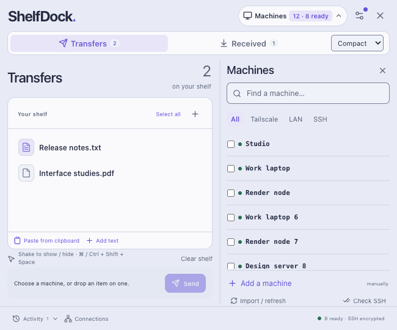 | 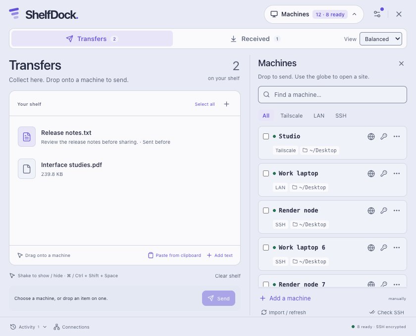 | 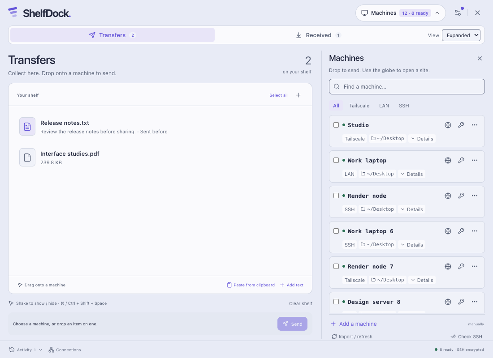 |
| Received history | 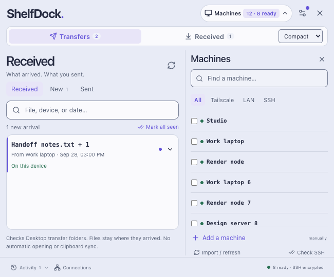 | 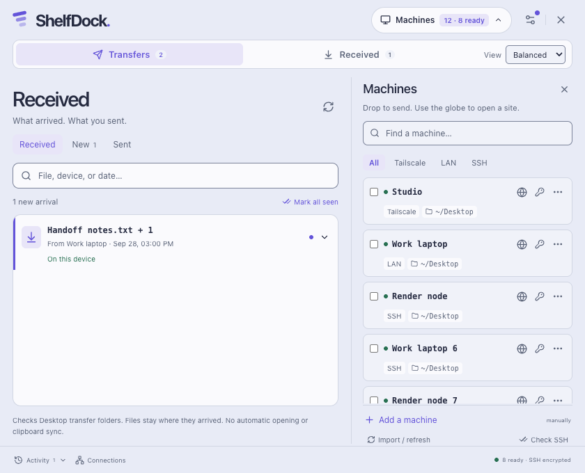 | 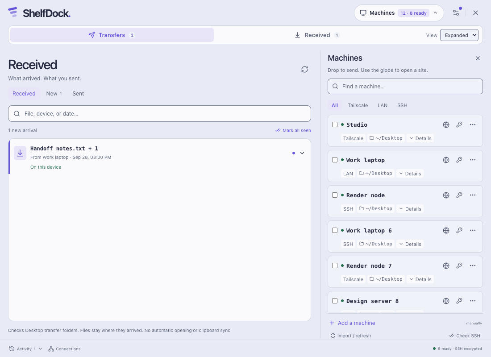 |
| Optional Clipboard | 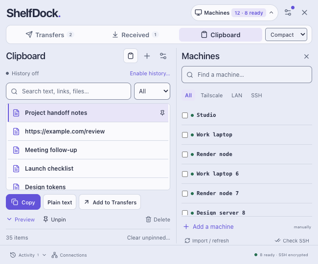 | 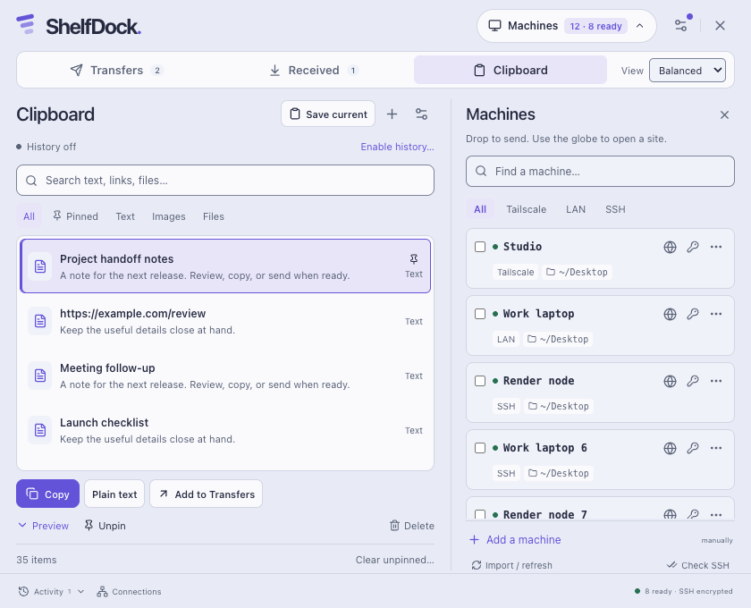 | 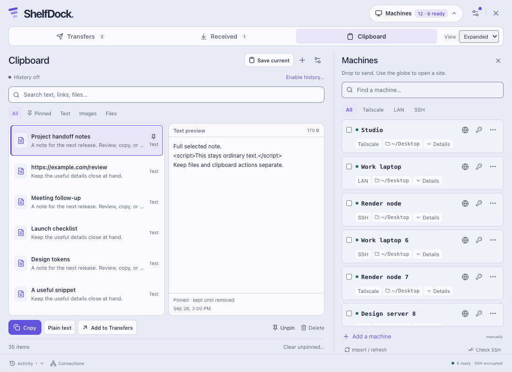 |
| Updates | 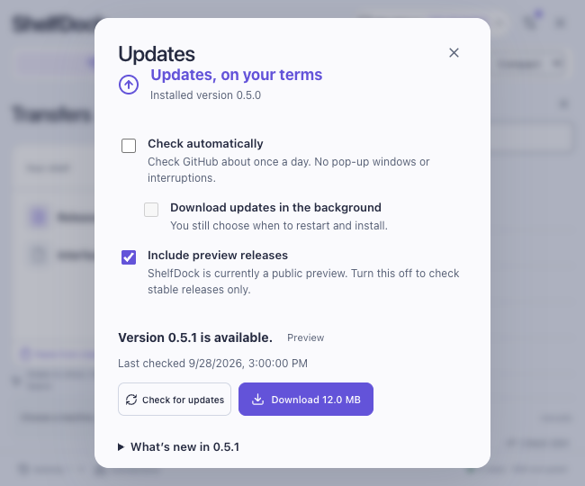 | 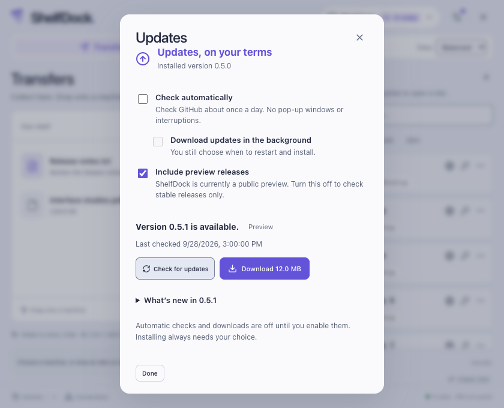 | 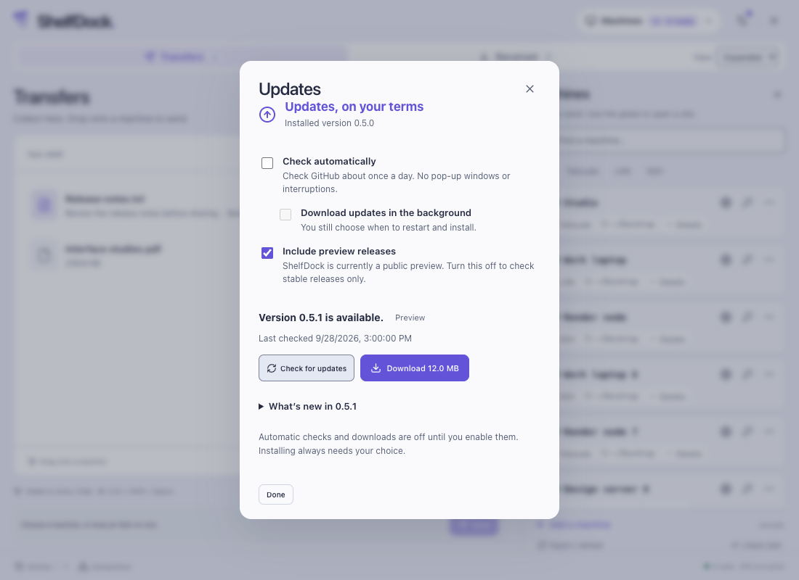 |

For the previous interface, use the immutable [0.4.2 Compact](https://github.com/LexiLominite/ShelfDock/blob/v0.4.2/docs/optional-tools/compact-default.png), [Balanced](https://github.com/LexiLominite/ShelfDock/blob/v0.4.2/docs/optional-tools/balanced-default.png), and [Expanded](https://github.com/LexiLominite/ShelfDock/blob/v0.4.2/docs/optional-tools/expanded-default.png) screenshots. Their historical DropHarbor label is intentional.

## Update interaction checks

`tests/ui/updates.cjs` adds an updater-only bridge mock to the existing headless UI fixture. It verifies:

- Automatic checks and background downloads begin off; downloads depend on enabled automatic checking. Merely opening the panel does not check releases.
- An explicit check produces an available-update status and retains the Settings badge after the panel closes.
- Download progress survives closing and reopening the panel. Cancellation, checksum failure and retry remain visible and do not install anything.
- Installation requires **Install update…** followed by **Restart and install**. A live forward disables the second action. Preparing an installation locks dialog closure; an error restores it.
- A protected or unsupported installation offers manual package instructions rather than an install action.
- Private-edition missing GitHub CLI/authentication guidance offers the private release page. Retrying with the mocked existing authentication retains the private repository and LexBridge package edition; it does not switch to the public feed.
- Every density keeps the dialog within the viewport, avoids horizontal body overflow, and lets keyboard/pointer users scroll to the bottom actions.

These are UI behavior checks using fictional bridge responses. They do not contact GitHub, install a package, exercise real authentication or prove native updater correctness; the separate backend tests and release verification provide that evidence.
